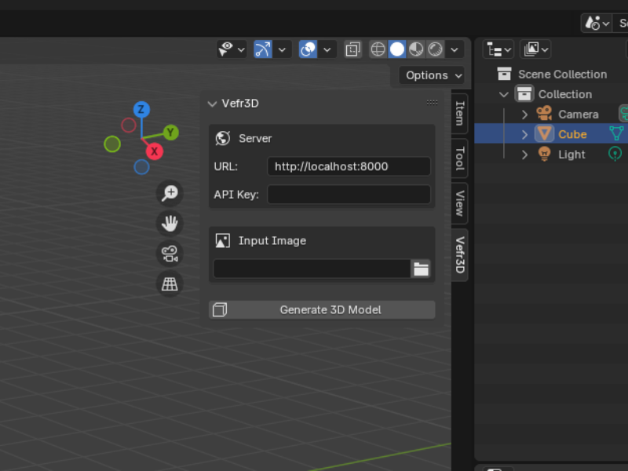

<!-- Improved compatibility of back to top link: See: https://github.com/othneildrew/Best-README-Template/pull/73 -->
<a id="readme-top"></a>
<!--
*** Thanks for checking out the Best-README-Template. If you have a suggestion
*** that would make this better, please fork the repo and create a pull request
*** or simply open an issue with the tag "enhancement".
*** Don't forget to give the project a star!
*** Thanks again! Now go create something AMAZING! :D
-->


<!-- PROJECT SHIELDS -->
<!--
*** I'm using markdown "reference style" links for readability.
*** Reference links are enclosed in brackets [ ] instead of parentheses ( ).
*** See the bottom of this document for the declaration of the reference variables
*** for contributors-url, forks-url, etc. This is an optional, concise syntax you may use.
*** https://www.markdownguide.org/basic-syntax/#reference-style-links
-->
<!-- PROJECT LOGO -->
<br />
<div align="center">
  <a href="https://github.com/JasperNg/Vefr3D">
    
  </a>

<h3 align="center">Vefr3D</h3>

  <p align="center">
    Self-Hosted 3D-model Generation Toolkit
    <br />
    <a href="https://github.com/github_username/repo_name/issues/new?labels=bug&template=bug-report---.md">Report Bug</a>
  </p>
</div>


<!-- TABLE OF CONTENTS -->
<details>
  <summary>Table of Contents</summary>
  <ol>
    <li>
      <a href="#about-the-project">About The Project</a>
      <ul>
        <li><a href="#built-with">Built With</a></li>
      </ul>
    </li>
    <li>
      <a href="#getting-started">Getting Started</a>
      <ul>
        <li><a href="#prerequisites">Prerequisites</a></li>
        <li><a href="#installation">Installation</a></li>
      </ul>
    </li>
    <li><a href="#usage">Usage</a></li>
    <li><a href="#contributing">Contributing</a></li>
    <li><a href="#license">License</a></li>
    <li><a href="#contact">Contact</a></li>
    <li><a href="#acknowledgments">Acknowledgments</a></li>
  </ol>
</details>


<!-- ABOUT THE PROJECT -->
## About The Project
<p align="center">
  
</p>
Vefr3D is a self-hosted 3D model generation toolkit designed for game development studios. The Blender plugin connects to a FastAPI server serving a ComfyUI workflow. Once the model is generated, it is automatically imported into the viewport. 

<p align="right">(<a href="#readme-top">back to top</a>)</p>


### Built With
[![FastAPI][FastAPI]][FastAPI-url]  [![Blender Python Package][Blender]][Blender-url]

<p align="right">(<a href="#readme-top">back to top</a>)</p>


<!-- GETTING STARTED -->
## Getting Started
Vefr3D was tested on Windows 11 with Nvidia Driver 595.79 using Anaconda on both a RTX 3060 mobile (145w) and a 4070 Super with Blender 4.2 LTS. 

### Prerequisites
* [Anaconda](https://www.anaconda.com/download)
* [Blender 4.2](https://www.blender.org/download/lts/4-2/#versions)
* [scoop](https://scoop.sh/) to install ngrok (run in Powershell)
  ```sh
  Set-ExecutionPolicy -ExecutionPolicy RemoteSigned -Scope CurrentUser
  Invoke-RestMethod -Uri https://get.scoop.sh | Invoke-Expression
  ```
* [ngrok](https://ngrok.com/) if you need to deploy the API
  ```sh
  scoop install ngrok
  ```

### Install server
1. Clone the repo
   ```sh
   git clone https://github.com/JasperNg/Vefr3D.git
   ```
2. Create conda environment from the yaml file
   ```sh
   cd envs
   conda create --file environment.yml
   ```
3. Activate your environment and create your API key
   ```py
   # python
   import secrets
   secrets.token_urlsafe(24)
   ```
4. Add the API to your Windows environment variables as `CUI_API_KEY`
5. Download and install [ComfyUI-Easy-Install](https://github.com/Tavris1/ComfyUI-Easy-Install) in the Trellis 2 folder with Flash Attention and Torch 2.8.0

### Install Plugin
1. Zip the plugin folder
2. Navigate to Blender Preferences' System tab to allow Online Access
   <br/>
   ![net-access][netaccess-screenshot]
3. Navigate to Blender Preferences' Get Extensions and install the Zip file
   <br/>
   ![install-disk][disk-screenshot]

<p align="right">(<a href="#readme-top">back to top</a>)</p>


<!-- USAGE EXAMPLES -->
## Usage
### Start Server
1. Open a CMD terminal in the Vefr3D folder and boot the ComfyUI instance
   ```sh
   "Trellis2\ComfyUI-Easy-Install\Start ComfyUI FlashAttention.bat"
   ```
2. Open a new CMD Terminal and activate the conda environment
   ```sh
   conda activate Vefr3D
   ```
3. Activate the server
   ```sh
   uvicorn main:app --reload
   ```
4. Open a new CMD Terminal and push the API with ngrok (if necessary)
   ```sh
   ngrok http http://127.0.0.1:8000/ --url=YOUR_NGROK_URL
   ```

<p align="right">(<a href="#readme-top">back to top</a>)</p>


<!-- CONTRIBUTING -->
## Contributing
If you have a suggestion that would make this better, please fork the repo and create a pull request. You can also simply open an issue with the tag "enhancement".

1. Fork the Project
2. Create your Feature Branch
3. Commit your Changes 
4. Push to the Branch 
5. Open a Pull Request

<p align="right">(<a href="#readme-top">back to top</a>)</p>

<!-- LICENSE -->
## License

Distributed under the MIT License. See `LICENSE.txt` for more information.

<p align="right">(<a href="#readme-top">back to top</a>)</p>


<!-- CONTACT -->
## Contact

Jasper Ng - jasperdng@gmail.com

<p align="right">(<a href="#readme-top">back to top</a>)</p>

<!-- ACKNOWLEDGMENTS -->
## Acknowledgments

* [ComfyUI-Easy-Install](https://github.com/Tavris1/ComfyUI-Easy-Install)


<p align="right">(<a href="#readme-top">back to top</a>)</p>

<!-- MARKDOWN LINKS & IMAGES -->
<!-- https://www.markdownguide.org/basic-syntax/#reference-style-links -->
[product-screenshot]: GithubAssets/screenshot.png
[netaccess-screenshot]: GithubAssets/netaccess.png
[disk-screenshot]: GithubAssets/disk.png
[plugin-screenshot]: GithubAssets/plugin.png
<!-- Shields.io badges. You can a comprehensive list with many more badges at: https://github.com/inttter/md-badges -->
[FastAPI]: https://img.shields.io/badge/FastAPI-009485.svg?logo=fastapi&logoColor=white
[FastAPI-url]: https://fastapi.tiangolo.com/
[Blender]: https://img.shields.io/badge/Blender-%23F5792A.svg?logo=blender&logoColor=white
[Blender-URL]: https://pypi.org/project/bpy/
